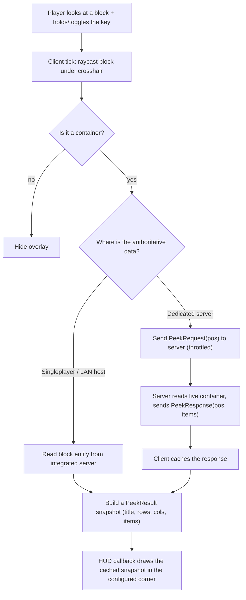

# Container Peeker — High-Level Design

This document is a guided tour of *how* this project was built: the goal, the research,
the key decisions, how the pieces fit together, and how it was tested. It's meant to be
read top-to-bottom to get an intuition for the whole thing. For install/usage see
[README.md](README.md); for contributor mechanics see [AGENTS.md](AGENTS.md).

---

## 1. The goal

> "A configurable hotkey that, while held (or toggled), shows a small overlay in a
> corner of the screen with the contents of whatever container I'm looking at — sized
> to the container (hopper = 5, dropper = 9, chest = 27, double chest = 54)."

Distilled into requirements:

- **Non-intrusive overlay** in a *configurable* screen corner.
- **Auto-sizing grid** that matches the container type.
- **Hold or toggle** activation, on a *rebindable* key.
- Target **Minecraft 1.21.11 / Fabric**.
- Eventually: **works in multiplayer** (dedicated servers), not just singleplayer.

---

## 2. Research & what informed the design

Before writing code, the key question was: *can a client even know what's inside a
container it hasn't opened?* The answer drove the whole architecture.

**What was looked at / considered:**

- **Fabric API** — the foundation. It provides exactly the hooks we need without
  mixins: `KeyBindingHelper` (rebindable keys), `HudRenderCallback` (draw an overlay),
  `ClientTickEvents` (per-tick logic), and the networking API
  (`ClientPlayNetworking` / `ServerPlayNetworking`) for multiplayer.
- **"What block am I looking at" mods (JADE / WTHIT / the old WAILA family)** — these
  proved the *interaction model* (raycast to the block under the crosshair, show info)
  and, importantly, showed how they handle the multiplayer data problem: a client can't
  trust its own world copy for container contents, so info either comes from the
  integrated server or via a server-side companion that sends the data.
- **MaLiLib** (the user explicitly asked about it) — a powerful shared config/util
  library used by many mods. **Decision: don't use it.** It's a heavy dependency that
  would force users to install another mod, and we only need a tiny config + a simple
  overlay. Fabric API + a small JSON config covers it with zero extra user-facing deps.
- **Cloth Config + Mod Menu** — the de-facto standard for in-game settings GUIs. These
  *are* worth integrating, but only as **optional** dependencies (see §4).

**The critical realization:** in singleplayer the client *is* the server (integrated
server), so contents are directly readable. On a **dedicated server**, the client's
copy of a block entity's inventory is usually empty/stale — the server is authoritative.
So multiplayer fundamentally needs a **server-side component** that answers "what's in
this container?" That insight is why the mod ships as `environment: "*"` (loads on both
client and server) and defines a request/response packet pair.

---

## 3. The core idea in one picture



The key structural decisions visible here:

- **Resolve once per tick, draw every frame.** Raycasting + copying item stacks is
  comparatively expensive, so it happens 20×/sec (per tick) and the render callback just
  draws the cached `PeekResult`. This keeps the overlay cheap at any framerate.
- **One unified `PeekResult`** regardless of data source, so the renderer doesn't care
  whether the data came from the integrated server or over the network.

---

## 4. Key design decisions (and the "why")

| Decision | Why |
| --- | --- |
| **No mixins** | Everything needed exists as Fabric API events. Avoiding mixins minimizes conflicts with other mods and keeps the mod robust across patch updates. |
| **`environment: "*"`** | The mod must load on dedicated servers to answer content requests. The common entry point stays server-safe; all rendering/keybind code is isolated in the client source set. |
| **Mojang official mappings** | Yarn is EOL after 1.21.11. Using Mojang mappings is the forward-looking choice for this version. |
| **`HopperBlockEntity.getContainerAt(level, pos)`** for reading | It returns a `Container` for *any* container block entity **and transparently merges double chests** — so we don't special-case chest halves ourselves. |
| **Tiny JSON config by default; Cloth/Mod Menu optional** | Users get full functionality with zero extra mods. Those who want a GUI can add Mod Menu + Cloth Config; they're declared as `suggests`, never `depends`. |
| **Throttled, target-aware network requests** | On servers we cap repeat requests for the same block (~10/sec) but fire immediately when the target changes, so rapidly scanning a wall of chests stays responsive without spamming the server. |
| **Server validates distance (~8 blocks)** | A light sanity check so the packet can't be trivially abused to read arbitrary far-away containers. (It's distance, not line-of-sight — see Limitations in the README.) |
| **Read-only** | The mod never writes to containers, eliminating any dupe/corruption risk. |

---

## 5. Source code layout

Two Fabric **source sets**: `main` (common — runs everywhere, including dedicated
servers) and `client` (client-only — rendering, input, config GUI).

```
src/main/java/com/adubs/containerpeeker/
  ContainerPeeker.java        # Common ModInitializer. MOD_ID + LOGGER, registers the
                              # payload types, and hosts the SERVER-side request handler
                              # that reads a container and replies. Must stay server-safe.
  net/PeekPayloads.java       # The wire format: PeekRequest (C2S, a BlockPos) and
                              # PeekResponse (S2C, BlockPos + item list), each with its
                              # CustomPacketPayload.Type and StreamCodec.

src/client/java/com/adubs/containerpeeker/client/
  ContainerPeekerClient.java  # Client ModInitializer. Owns the keybind, the per-tick
                              # loop (resolve + maybe send a request), the response
                              # receiver, and the HUD render hook.
  ContainerReader.java        # The "what am I looking at, and what's inside it" brain.
                              # Raycasts, reads the integrated server (or remote cache),
                              # and produces the PeekResult snapshot. Holds PeekResult.
  PeekHud.java                # Pure rendering: given a PeekResult, draws the panel,
                              # title, and item grid via GuiGraphics in the chosen corner.
  PeekConfig.java             # Gson-backed settings at config/containerpeeker.json.
  PeekConfigScreen.java       # Builds the Cloth Config settings screen.
  ModMenuIntegration.java     # ModMenuApi entrypoint -> opens PeekConfigScreen.

src/main/resources/
  fabric.mod.json             # Manifest: id, environment "*", entrypoints, deps/suggests.
  assets/containerpeeker/lang/en_us.json   # Keybind category + name strings.

scripts/release.sh            # Build + bump + tag + push + GitHub release.
```

**Responsibility split, in one line each:**

- *What/where am I looking?* → `ContainerReader`
- *How do I get the data on a server?* → `PeekPayloads` + the handler in `ContainerPeeker` (server) and the receiver in `ContainerPeekerClient` (client)
- *How does it look on screen?* → `PeekHud`
- *What are the user's preferences?* → `PeekConfig` (+ `PeekConfigScreen` / `ModMenuIntegration` for the GUI)
- *Glue / lifecycle* → `ContainerPeekerClient` (client) and `ContainerPeeker` (common)

---

## 6. How a single "peek" flows through the code

1. **Input + tick** — `ContainerPeekerClient` checks the keybind each client tick and,
   if active, asks `ContainerReader.resolveLookedAtContainer(...)`.
2. **Resolve** — `ContainerReader` raycasts the block under the crosshair. If it's a
   container:
   - **Integrated server present** → read the authoritative block entity now and build a
     `PeekResult` directly.
   - **Remote server** → return a `PeekResult` from the most recent cached
     `PeekResponse` for that position (possibly empty until the reply arrives), and the
     client fires a throttled `PeekRequest(pos)`.
3. **Server answers (multiplayer only)** — `ContainerPeeker`'s receiver validates the
   sender's distance, reads the live container via `HopperBlockEntity.getContainerAt`,
   and sends back a `PeekResponse(pos, items)`.
4. **Cache** — `ContainerPeekerClient`'s response receiver stores the items in
   `ContainerReader`'s cache, keyed by position.
5. **Render** — the `HudRenderCallback` takes the cached `PeekResult` and `PeekHud`
   draws it: background panel at the configured corner/margins/scale/opacity, optional
   title, then the item grid laid out to the container's row/column shape.

---

## 7. Multiplayer sync, a bit deeper

- **Why packets at all?** A non-host client's world data for an unopened container's
  inventory isn't reliable; the server owns the truth. So we ask the server.
- **Registration symmetry** — payload **types** are registered in the *common*
  initializer so both sides agree on the wire format. The server registers the
  *request handler*; the client registers the *response receiver*.
- **Graceful degradation** — the client guards every send with
  `ClientPlayNetworking.canSend(...)`. On a server without the mod, that's `false`, so
  the client simply sends nothing and the overlay shows empty. Nothing errors.
- **Politeness/throttling** — repeated requests for the *same* block are rate-limited
  (~10/sec), but switching to a new block sends immediately, matching the "flying past a
  wall of chests" use case without flooding the server.

---

## 8. How it was tested

- **Iterative compile loop** — `./gradlew build` after each change, with a few
  1.21.11-specific compile errors fixed along the way (see the mapping gotchas list in
  [AGENTS.md](AGENTS.md): `Identifier` vs `ResourceLocation`, `KeyMapping.Category`,
  payload-type creation, `GuiGraphics` matrix stack, getting the server off a player).
- **Singleplayer smoke test** — installed the built jar into a real 1.21.11 Fabric
  profile and confirmed the overlay appears and shows correct contents for hoppers,
  droppers, single and double chests. (Confirmed working by the user.)
- **Environment guards** — verified the common entry point doesn't touch client-only
  classes so the mod can load on a dedicated server.
- **Networking design validated against degradation** — the `canSend` guard ensures a
  vanilla/no-mod server doesn't break the client; a modded server returns live contents.

> Honest scope note: the most thorough hands-on validation was singleplayer. The
> dedicated-server path is built to the Fabric networking contract and guarded for
> graceful degradation, but is the area most worth additional real-world testing.

---

## 9. Build, version, and release

- **Single source of version truth:** `mod_version` in `gradle.properties` (also names
  the jar). Pinned dependency versions live there too.
- **Build:** `./gradlew build` → `build/libs/containerpeeker-<version>.jar`.
- **Release:** `scripts/release.sh [patch|minor|major|--set X.Y.Z] [-y]` selects JDK 21,
  optionally bumps + commits the version, builds clean, tags `vX.Y.Z`, pushes, and cuts
  a GitHub release with the jar attached. See [AGENTS.md](AGENTS.md#versioning--releasing).

---

## 10. Possible future directions

- Cache invalidation / live updates while staring at a container whose contents change.
- Optional line-of-sight check server-side for stricter validation.
- Render enchantments/durability/NBT hints in the overlay.
- Per-container-type overlay toggles (e.g., ignore hoppers).
- Localization beyond `en_us`.
